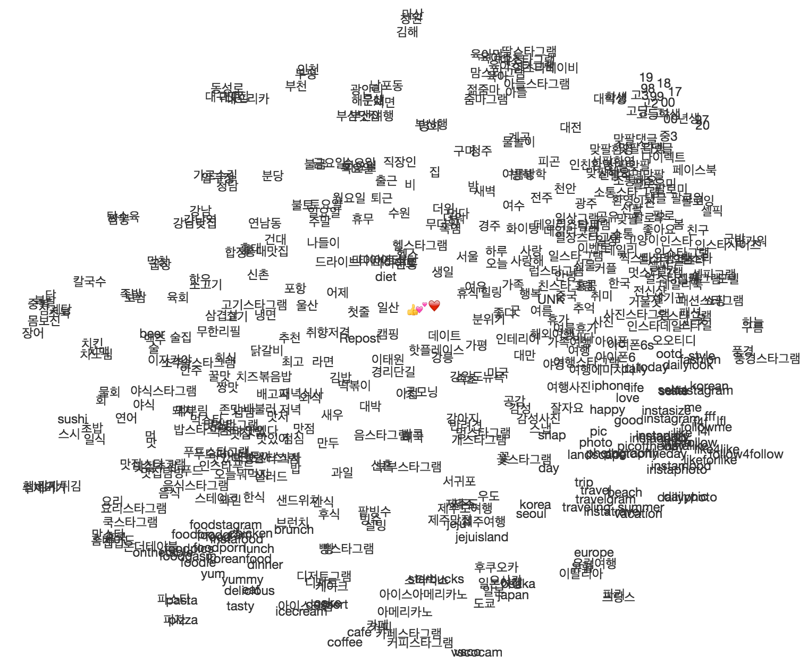

# Tag2vec
인스타그램 태그를 Word2vec으로 학습시킨 태그 벡터 공간입니다. https://tag2vec.herokuapp.com/

Tensorflow의 [word2vec_optimized.py](https://github.com/tensorflow/tensorflow/blob/master/tensorflow/models/embedding/word2vec_optimized.py) 코드를 사용하여 구현하였습니다. 



## Requirements
- Linux or Mac OS
- [Python](https://www.python.org/) 2.7
- [Tensorflow](https://www.tensorflow.org/) 0.9+
- [Flask](http://flask.pocoo.org/)
- [sklearn](http://scikit-learn.org/)

## 학습 데이터
인스타그램에서 올려진 글에서 태그를 추출하여 이어지는 태그를 문장으로 취급하였습니다.
하지만 글들의 이어지는 태그는 연관성이 없어서 skip-gram model에서 window 선택시 해당 문장에서만 선택하도록 학습하였습니다.

인스타그램 태그 수집기: https://github.com/muik/instagram-tag-crawler

## 기능
1. 유사 태그: word2vec의 nearby
2. 다중 유사 태그: 여러 태그의 공통으로 유사한 태그 조회
3. 부정 태그: 태그와 거리가 먼 태그 조회
4. 추론: word2vec의 analogy
5. 별개 태그: gensim word2vec의 doesnt_match 구현

## 설치
```
$ pip install -t lib -r requirements.txt
$ pip install sklearn
```
## 데모 웹 실행
```
$ python web.py
```

## 학습 데이터 형식
학습 시키기 위해서는 data/tags.txt, data/questions-tags.txt 파일의 학습데이터가 필요합니다.
#### data/tags.txt
```
여름 먹방 시원한 냉면 냉면맛집 물냉면
물놀이 계곡 힐링 휴가 강원도
...
```
#### data/questions-tags.txt
```
비냉 비빔냉면 물냉 물냉면
이태원 경리단길 신사동 가로수길
...
```

## 기존 학습데이터 삭제
```
$ rm train/model.ckpt*
```
## 학습 실행
```
$ python word2vec_optimized.py
```
